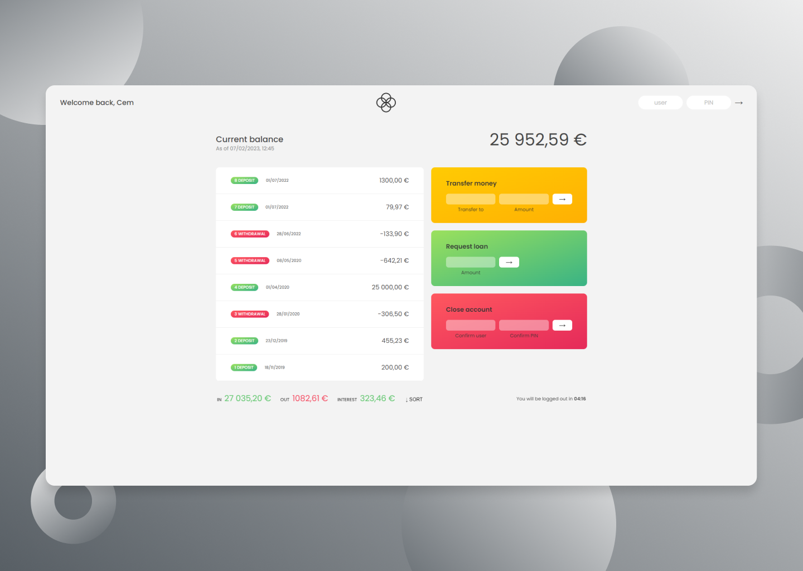

  

    <h1>Bankist App</h1>
     
    
A banking app that allows to do some basics financial operations

    <h3><a href="https://bankistapp-cem.netlify.app/">🔗 Link to the Website</a></h2>
    
  

## Built With

## Features

- JS ES6 Features
- Many string and array methods
- setTimeout, setInterval, clearInterval built-in API's

## Context of the project

This is a part of a JavaScript Course that i've completed on Udemy
